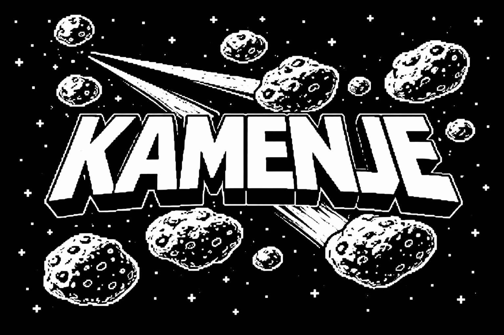

# Kamenje

`Kamenje` is an Asteroids-style vector arcade game for the Iskra Delta Partner.
It is written in C for Z80/CP/M, uses UGPX graphics, and builds into both a
`.com` program and a CP/M floppy disk image.



## Features

- Fast vector-style gameplay with wraparound movement
- Rotating ship, thrust, inertia, bullets, and asteroid splitting
- Wave progression with score and lives HUD
- Double-buffered rendering for cleaner animation
- Title and game-over screens in Slovenian, matching the in-game UI

## Controls

### In menus

- `Enter` - start a new game
- `Q` or `Esc` - quit

### In game

- `A` - rotate left
- `D` - rotate right
- `W` - thrust
- `Space` or `Enter` - fire
- `Q` or `Esc` - quit

## Gameplay

- You start with 3 lives.
- The first wave starts with 6 large asteroids.
- Later waves gradually add more asteroids, up to a cap.
- Destroyed asteroids split into smaller fragments until fully cleared.
- The playfield wraps around on both axes.
- Score for large asteroids: 8 points.
- Score for medium asteroids: 16 points.
- Score for small asteroids: 24 points.

## Build

The top-level build uses Docker so you do not need the full SDCC/UGPX toolchain
installed on the host.

### Requirements

- Docker
- A sibling checkout of `libpartner` in the parent directory

Expected directory layout:

```text
parent/
├── aids/
└── libpartner/
```

Build the game:

```sh
make
```

Useful targets:

```sh
make docker-pull
make clean
make fix-perms
```

## Build Outputs

After a successful build, the generated files are:

- `bin/kamenje.com` - CP/M executable
- `bin/kamenje.img` - CP/M floppy disk image

Intermediate objects are placed under `build/`.

## Running

Run the produced artifacts in your preferred Iskra Delta Partner or CP/M setup:

- load `bin/kamenje.com` from CP/M, or
- boot / attach `bin/kamenje.img` in an emulator or on target hardware

## Project Layout

```text
src/main.c            Program entry point
src/game.c            Game loop, input, logic, and rendering
src/game.h            Public game interface
src/idp8x16_font.s    Bitmap font
src/kamenje_logo.inc  Generated logo data used by the title screen
assets/bitmaps/       Reference artwork
```

## Notes

- The game runs in `1024x512` graphics mode.
- The binary name is `kamenje` even though the repository directory is `aids`.
- The in-game strings are in Slovenian.
- `REZULTAT` means score.
- `VAL` means wave.
- `POSKUSI` means lives / attempts.
- `KONEC IGRE` means game over.
